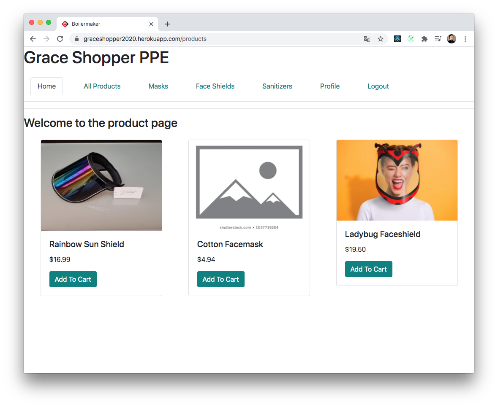

# Survive COVID!

We have everything you need to survive the 2020 pandemic!

Visit [Our PPE Shop](https://graceshopper2020.herokuapp.com/) to get what you need!

## Table of Contents

* [Setup](#Setup)
* [Team](#Team)
  * [Lu Wang](#Lu-Wang)
  * [Ariel Weiner](#Ariel-Weiner)
  * [Sara Culhane](Sara-Culhane)
* [Tech Stack](#Tech-Stack)
  * [React](#React)
  * [Redux](#Redux)
  * [Node.js](#Node.js)
  * [Express](#Express)
  * [PostgreSQL](#PostgreSQL)
* [Examples](#Examples)

## Setup

* Run the following commands:

```
cd <directory you want to clone this project>
git clone https://github.com/Grace-Shopper-PPE/Grace-Shopper
npm install
npm run start-dev
Go to http://localhost:8080 to use PPE Shop!
```

## Team

`Lu Wang`

[Github](https://github.com/LuWang1983)
[LinkedIn](https://www.linkedin.com/in/loowang)

`Ariel Weiner`

[Github](https://github.com/arielwainer4)
[LinkedIn](https://www.linkedin.com/in/arielwainer/)

`Sara Culhane`

[Github](https://github.com/sarajculhane)
[LinkedIn](https://www.linkedin.com/in/saraculhane/)

## Tech Stack

### React

https://reactjs.org/

* React is a JavaScript library for building user interfaces.

* React will efficiently update and render only the components that need to be rerendered.

* React is component-based and allows for each component to manage their own state.

### Redux

https://redux.js.org/

* Redux is an open-source JavaScript library for state management.

* Redux works together with React Native and Node to build complex user interfaces and retrieve data from the database, while easily managing state.

### Node.js

https://nodejs.org/en/

* Node is a JavaScript runtime environment built on Chrome's V8 JavaScript engine

### Express

https://expressjs.com/

* Express is a minimal and flexible Node.js web application framework that provides a robust set of features for web and mobile applications.

### PostgreSQL

https://www.postgresql.org/

* PostgreSQL is an open source object-relational database system that uses and extends the SQL language

## Examples


